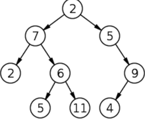

__Q: 使用JS 实现二叉查找树__

一般叫全部写完的概率比较少，但是重点考察你对它的理解和一些基本特点的实现。 二叉查找树，也称二叉搜索树、有序二叉树（英语：ordered binary tree）是指一棵空树或者具有下列性质的二叉树：

- 任意节点的左子树不空，则左子树上所有结点的值均小于它的根结点的值；
- 任意节点的右子树不空，则右子树上所有结点的值均大于它的根结点的值；
- 任意节点的左、右子树也分别为二叉查找树；
- 没有键值相等的节点。二叉查找树相比于其他数据结构的优势在于查找、插入的时间复杂度较低。为O(log n)。二叉查找树是基础性数据结构，用于构建更为抽象的数据结构，如集合、multiset、关联数组等。



在写的时候需要足够理解二叉搜素树的特点，需要先设定好每个节点的数据结构

```js
class Node {
  constructor(data, left, right) {
    this.data = data;
    this.left = left;
    this.right = right;
  }
}
```

树是有节点构成，由根节点逐渐延生到各个子节点，因此它具备基本的结构就是具备一个根节点，具备添加，查找和删除节点的方法.

[code](binary-search-tree.js)
