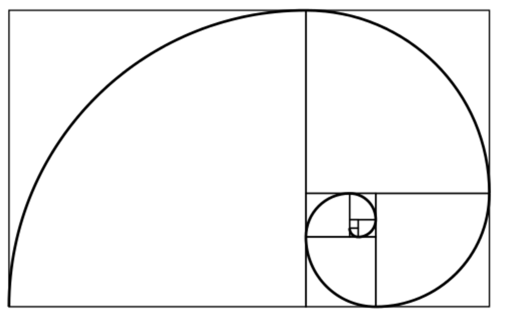

__Q: 使用`canvas`绘制一个有限度的斐波那契数列的曲线？__



数列长度限定在9.

__斐波那契数列__，又称黄金分割数列，指的是这样一个数列：0、1、1、2、3、5、8、13、21、34、……在数学上，斐波纳契数列主要考察递归的调用。我们一般都知道定义

```
fibo[i] = fibo[i-1] + fibo[i-2];
```

生成斐波那契数组的方法

```js
function getFibonacci(n) {
  var fibarr = [];
  var i = 0;
  while (i < n) {
    if (i <= 1) {
      fibarr.push(i);
    } else {
      fibarr.push(fibarr[i-1] + fibarr[i-2]);
    }
    i++;
  }

  return fibarr;
}
```

[demo](index.html)
